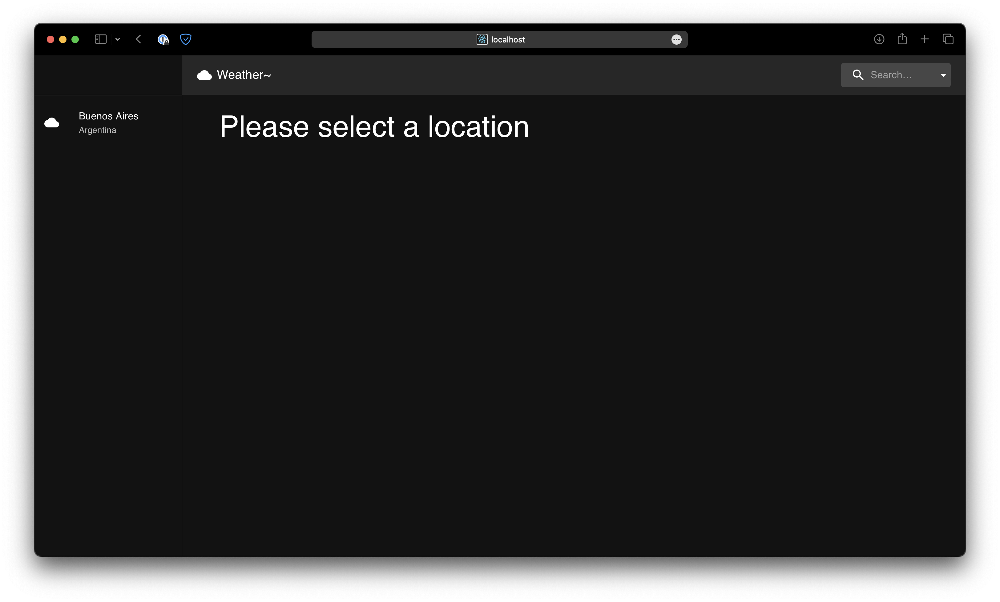
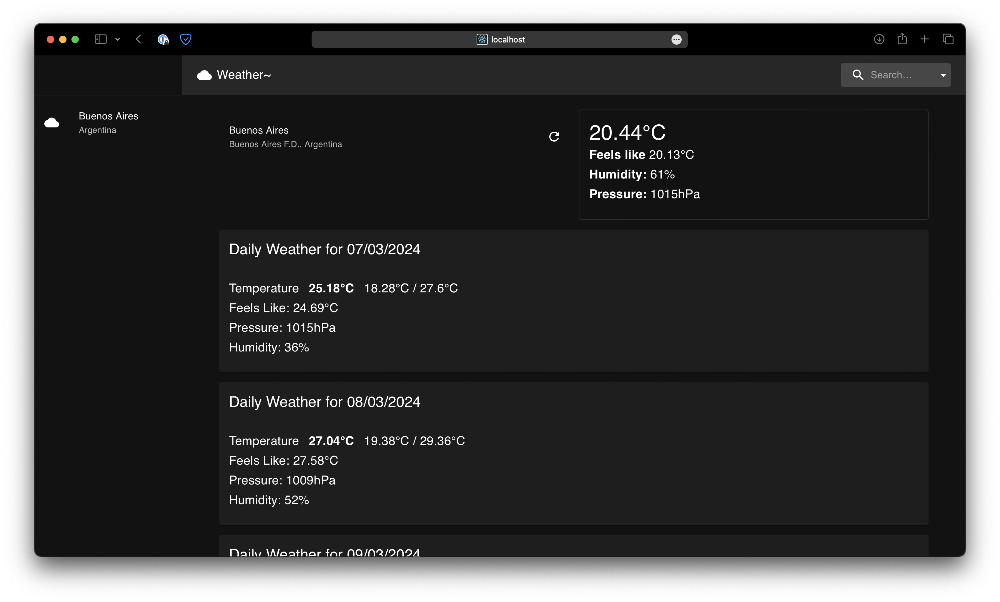
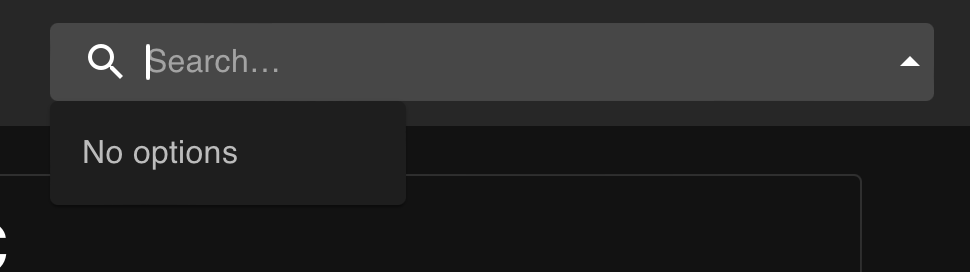
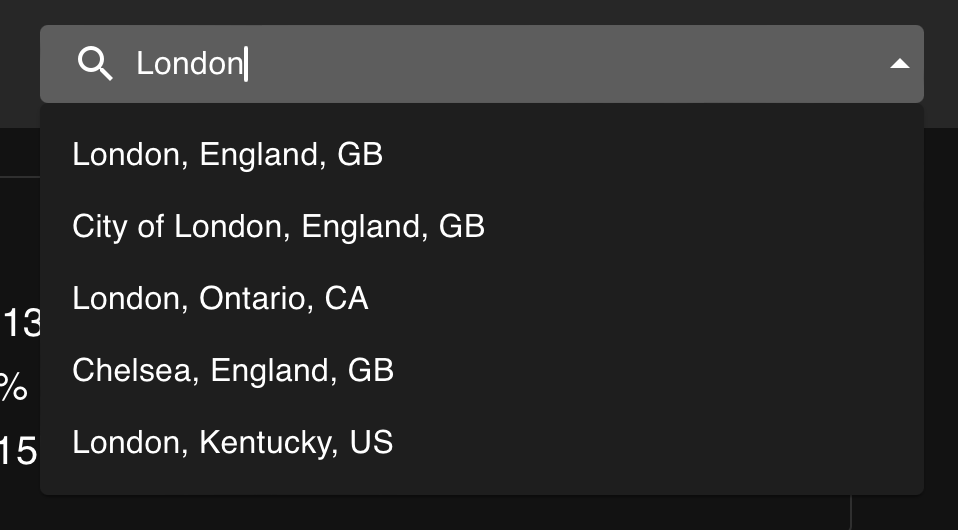
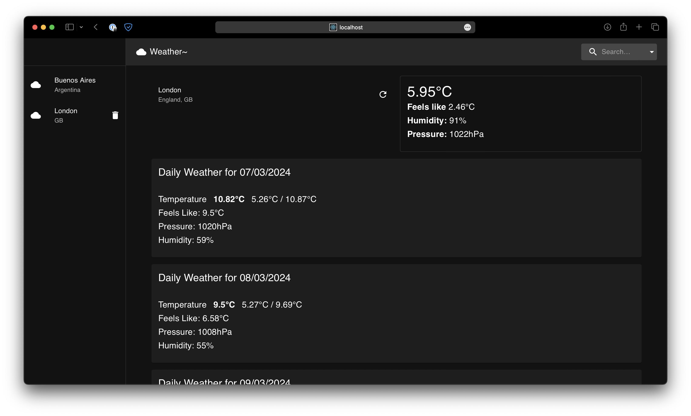

# FT-Weather-App

Simple weather app.

## Things to "fix" (never) / missing functionality

- UI sucks (it's ugly & doesn't handle user preferences)
- search seems to misbehave
- missing tests

## Current UX Workflow

* You are asked at start-up for your OpenWeatherMap API key

* You will be dropped into the main UI - your current location will be guessed and added to the list

* You can select it!

* You search type on search, and get results (it's buggy but, good enough!)

* ... and you get to see more locations!

